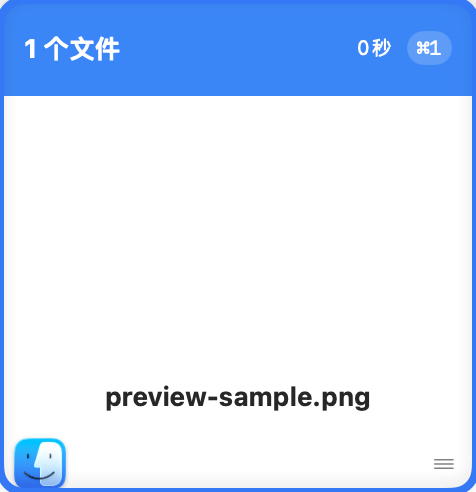
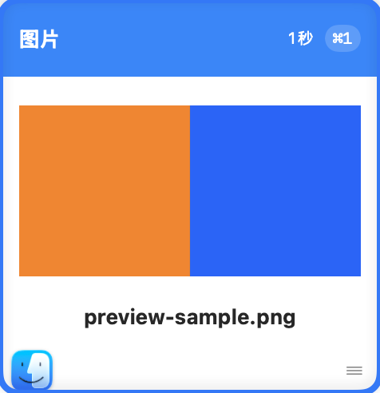

# 访达复制图片文件不显示预览

- 日期：2026-09-09
- 处理状态：代码与自动验证通过，已安装；等待已安装版本的界面验收。
- 历史记录说明：以下为 2026-09-09 验证记录。2026-10-06 用户要求推送最新代码并发布 0.1.2，本修复纳入该次发布；最新验证与未完成项见 [0.1.2 交付报告](../../../.spec-to-ship/release-v0.1.2/20261006_test-report-01.md)。

## 问题与根因

在访达选中 JPG / PNG 文件后按 Cmd+C，剪贴板提供文件 URL。解析器优先保留 `.files` 载荷，这是恢复文件复制、粘贴所必需的。但文件卡片一直只显示通用文件图标，没有加载图片内容；“图片”筛选也只匹配 `.image`，因此访达复制的图片无法正常预览或进入图片筛选结果。

## 修复

- 使用系统图片类型判断，让单张及纯图片文件组显示图片标题并进入图片筛选；文件筛选仍可找到这些记录，支持文件名搜索。
- 在后台通过 ImageIO 生成最长边不超过 512 像素的缩略图，并应用图片方向。卡片按比例显示，不在主线程解码整张大图。
- 保留 `.files` 载荷和原来的文件粘贴行为，无需迁移历史数据，已有图片文件记录同样适用。
- 文件缺失、损坏或非图片时保留回退显示。多张图片以第一张作为预览；图片和其他文件混合时保持普通文件组。

变更文件：

- `WPaste/Domain/ClipboardItem.swift`：图片文件类型与标题。
- `WPaste/Features/History/HistoryStore.swift`：图片筛选。
- `WPaste/Features/History/CardContentViews.swift`：后台缩略图及显示。
- `WPasteTests/Features/ClipboardCardViewTests.swift`：真实文件剪贴板、卡片图像、尺寸、颜色、回写文件 URL 与异常回退。
- `WPasteTests/Features/FeatureStoreTests.swift`：JPG / PNG / HEIC 文件类型、图片组、混合组与文件名搜索。

## 修复前后对照

本地生产视图通过 NSHostingView 实际渲染并截取。修复前来自本次改动前源码（基线 `fcd46eb`），修复后来自本次源码。两图使用同一张无私人信息的橙蓝测试图片、同一张 238 × 246 pt 卡片、浅色外观及 2 倍显示比例；相对时间相差约 1 秒。图片为真实渲染截图，并非示意图；此处对照不代替已安装版本的交互验收。

修复前：文件标题，预览区没有显示测试图片。

修复后：图片标题，橙蓝缩略图完整显示，文件名仍可见。

## 自动验证与交付

| 检查 | 结果与证据 |
|---|---|
| 先失败的缺陷测试 | 修复前 PNG、JPG 卡片没有预览对象；图片筛选也不返回图片文件，均确认失败 |
| 完整测试 | `Scripts/package-dmg.sh` 内的完整 `xcodebuild test` 通过；58 项测试，参数化后共 62 次执行，0 失败、0 跳过 |
| 编译与打包 | 同一脚本生成 Release 通用版（arm64、x86_64），无编译警告或错误 |
| Release archive | `build/WPaste.xcarchive` |
| DMG | `build/WPaste.dmg` |
| DMG 校验 | `hdiutil verify build/WPaste.dmg`：VALID |
| 签名 | 仓库固定签名身份验证通过，`codesign --verify --deep --strict` 通过 |
| 安装 | 停止旧进程 1162 后完整替换 `/Applications/WPaste.app`；安装包与 archive 的应用目录逐文件一致 |
| 启动 | `open -n /Applications/WPaste.app` 成功；新进程 35602 来自安装目录，检查时持续运行 |
| 原始图片局部验证 | 用户提供的 JPG 已通过生产卡片视图实际渲染，预览完整显示；该私人截图仅保存在被 Git 忽略的本地产物目录 |
| 已安装界面验收 | 待完成：已在访达选中原始 JPG 并 Cmd+C；界面工具读取 WPaste 时超时，需打开面板后继续查看预览与筛选 |
| Git 差异 | `git diff --check` 通过；保留原有 `AGENTS.md` 改动，不纳入本次提交 |
| 工程同步 | 打包脚本运行 XcodeGen，工程文件无差异 |

DMG SHA-256：`4c21f464330b66a4aefb8b2f4d34b4ee1817fbe9118806921bc77063223b3546`。

安装与 archive 主程序 SHA-256 相同：`ac6e7b94256134a0bc82cd3bf0a6298e6ed55b7f4b68f7affc28207d0a278f71`。

## 已知限制与待验收

- 当前本地安装沿用仓库固定签名；未执行 Developer ID 分发签名或公证。本次没有发布外部分发版本。
- 在本机 Apple 芯片上完成自动测试与启动验证，未做 Intel 实机验证。
- 图片文件仍依赖原始文件可访问；删除或移走原文件后保留既有文件缺失提示。
- 此报告记录时界面验收未完成；最新发布状态以 0.1.2 交付报告为准，仍不声明全部手工验收通过。
